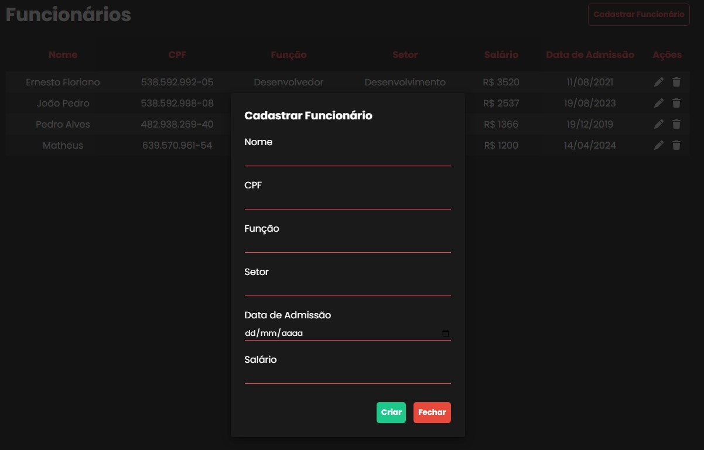

# CRUD Funcionários





## Como rodar

1. **Clonando o repositório:**
    ```bash
    git clone https://github.com/Erne1984/CRUD-cadastro-funcionarios.git
    cd CRUD-cadastro-funcionarios
    ```

2. **Rodando o back:**
    ```bash
    cd backend
    npm install
    npm run start
    ```

3. **Rodando o front:**
    ```bash
    cd frontend
    npm install
    npm run dev
    ```
Aplicação rodando no http://localhost:5173